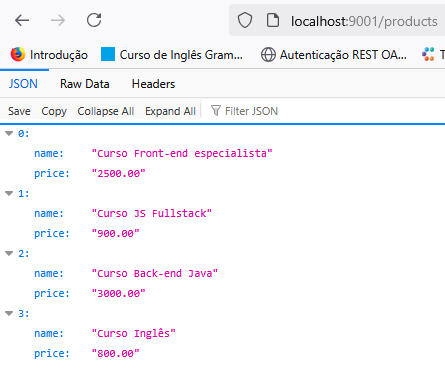
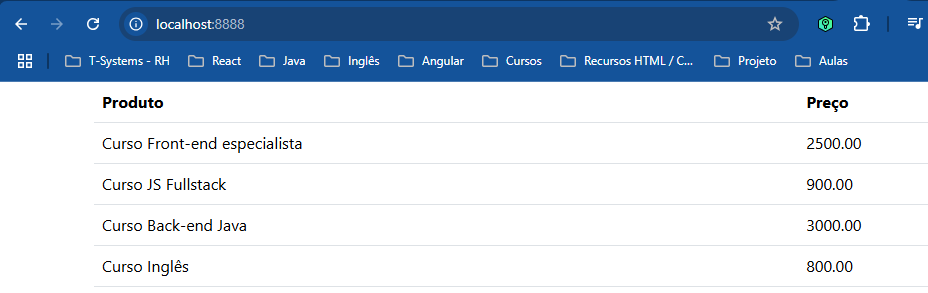
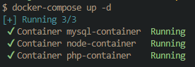
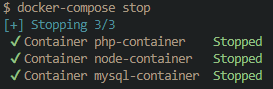

# Projeto exemplo para uso do  Docker

Criar pasta api -> db
dentro da pasta db criar os arquivos Dockerfile e script.sql onforme abaixo:

## Dockerfile:
```bash
### Derivando da imagem oficial do MySQL
FROM mysql

ENV MYSQL_ROOT_PASSWORD PAtanes
ENV MYSQL_DATABASE exemplodb
ENV MYSQL_USER UAtanes
ENV MYSQL_PASSWORD PAtanes

### Adicionando os scripts SQL para serem executados na criação do banco
COPY ./api/db/ /docker-entrypoint-initdb.d/
```	
## script.sql:
```sql
CREATE DATABASE IF NOT EXISTS exemplodb;
USE exemplodb;

CREATE TABLE IF NOT EXISTS products (
  id INT(11) AUTO_INCREMENT,
  name VARCHAR(255),
  price DECIMAL(10, 2),
  PRIMARY KEY (id)
);

INSERT INTO products VALUE(0, 'Curso Front-end especialista', 2500);
INSERT INTO products VALUE(0, 'Curso JS Fullstack', 900);
INSERT INTO products VALUE(0, 'Curso Back-end Java', 3000);
```

Na pasta raiz do projeto executar o comando docker para criar a imagem do mysql com as informações e a estrutura que você definiu no Dockerfile:
```bash
docker build -t mysql-image -f api/db/Dockerfile .
``` 
Para listar as imagens existentes você pode usar o comando:
```bash 
docker image ls
``` 
Para criar o nosso container utilzando a imagem que criamos vamos usar o comando:
```bash 
docker run -d -p 3306:3306 --rm --name mysql-container mysql-image
```
Dessa forma é possivel acessar as informações do banco de dados utilizando o DBeaver, por exemplo.

Se quiser manter os dados do banco de dados "salvos" após alguma alteração, inclusão, atualização e ou exclusão de dados é preciso fazer uso do **volume** do docker e o comando muda uma pouco:

```bash 
docker run -d -v d:/Repositorios/Docker/api/db/data:/var/lib/mysql -p 3306:3306 --rm --name mysql-container mysql-image
```
Obs.: Se o container estiver rodando é preciso pará-lo primeiro antes de executar o novo comando run, para parar o container você pode usar o comando:
```bash 
docker stop mysql-container
```
## Agora vamos criar o conatiner do node
Com o node instalado na sua máquina, dentro da pasta api execute o comando
```bash 
npm init
```
para instalar as dependencias do node na pasta do projeto.

Instalar o nodemon para fazer reload automático dos arquivos javascript sempre que existeir alguma atualização:

```bash 
npm install --save-dev nodemon
```
Instalar o express paar facilitar a criação de rotas para a aplicação e o banco de dados:

```bash 
npm install save express mysql
```
No arquivo package.json que foi criado na pasta api é preciso incluir o comando start:
```json
"scripts": {
    "test": "echo \"Error: no test specified\" && exit 1",
    "start": "nodemon index.js"
  }, 
```
Atualizar o pacote do mysql no node para evitar problemas de autenticação na hora de rodar a aplicação:
```bash
 npm un mysql && npm i mysql2
```
Criar o arquivo index.js:
```javascript
const express = require('express');
const mysql = require('mysql2');

const app = express();

const connection = mysql.createConnection({
    host     : 'mysql-container',
    user     : 'UAtanes',
    password : 'PAtanes',
    database : 'exemplodb'
});

connection.connect();

app.get('/products', function(req, res) {
  connection.query('SELECT * FROM products', function (error, results) {

    if (error) { 
      throw error
    };

    res.send(results.map(item => ({ name: item.name, price: item.price })));
  });
});


app.listen(9001, '0.0.0.0', function() {
  console.log('Listening on port 9001');
})
```
Obs.: Para saber o IP do mysql-container podemos usar o comando:
```bash
docker inspect mysql-container
```
Construir o container do node com o comando:
```bash
docker run -d -v d:/Repositorios/Docker/api:/home/node/app -p 9001:9001 --link mysql-container --rm --name node-container node-image
```
Verificar se os dois containers estão rodando com o comando:
```bash
docker ps
```
O resultado deve ser alguma coisa parecido com isso:
```bash
CONTAINER ID   IMAGE         COMMAND                  CREATED          STATUS          PORTS                    NAMES
2c91ee50d278   node-image    "docker-entrypoint.s…"   10 seconds ago   Up 8 seconds    0.0.0.0:9001->9001/tcp   node-container
e35892af715c   mysql-image   "docker-entrypoint.s…"   25 minutes ago   Up 25 minutes   3306/tcp, 33060/tcp      mysql-container
```
Se estiver tudo certo podemos abrir o browser e digitar a url 
http://localhost:9001/products para ver as informações armazenadas no banco de dados dessa forma:
  

  
Agora vamos construir a imagem e o container do PHP para deixar nosso "front-end" mais agradável e bonito:

Criar uma pasta website na raiz do projeto e dentro dessa pasta criar o arquivo Dockerfile:
```bash
FROM php:7.2-apache
WORKDIR /var/www/html
```
e o arquivo index.php:

```php
<!DOCTYPE html>
<html lang="en">
<head>
  <meta charset="UTF-8">
  <title>Docker | Programador a Bordo</title>
  <link href="https://cdn.jsdelivr.net/npm/bootstrap@5.3.3/dist/css/bootstrap.min.css" rel="stylesheet" integrity="sha384-QWTKZyjpPEjISv5WaRU9OFeRpok6YctnYmDr5pNlyT2bRjXh0JMhjY6hW+ALEwIH" crossorigin="anonymous">
</head>
<body>
  <?php
    $result = file_get_contents("http://node-container:9001/products");
    $products = json_decode($result);
  ?>
  
  <div class="container">
    <table class="table">
      <thead>
        <tr>
          <th>Produto</th>
          <th>Preço</th>
        </tr>
      </thead>
      <tbody>
        <?php foreach($products as $product): ?>
          <tr>
            <td><?php echo $product->name; ?></td>
            <td><?php echo $product->price; ?></td>
          </tr>
        <?php endforeach; ?>
      </tbody>
    </table>
  </div>
</body>
</html>
```
construir a imagem com o comando
```bash
docker build -t php-image -f website/Dockerfile .
```
e depois criar o container com o comando
```bash
docker run -d -v d:/Repositorios/Docker/website:/var/www/html -p 8888:80 --link node-container --rm --name php-container php-image
```
O resultado final no browser deve ser esse:
  


# Docker Compose
## Otimizando a execução dos containers

Com o comando docker-compose podemos agilizar e organizar melhor a criação e execução dos containers da nossa aplicação, dessa forma temos um maior controle e centralização dos comandos / configurações de todos os containers que compõe nossa aplicação.

Precisamos criar um arquivo docker-compose.yml na raiz da nossa aplicação com o conteúdo:

```yaml
version: "3.7"
services:
  db:
    image: mysql
    container_name: mysql-container
    expose:
      - "3306"
    ports:
      - "3306:3306"
    volumes:
     - ./api/db/script.sql:/docker-entrypoint-initdb.d/script.sql
    environment:
      MYSQL_ROOT_PASSWORD: PAtanes
      MYSQL_DATABASE: exemplodb
      MYSQL_USER: UAtanes
      MYSQL_PASSWORD: PAtanes
  api:
    build: "./api"
    container_name: node-container
    restart: always
    volumes:
     - d:/Repositorios/Docker/api:/home/node/app
    expose:
      - "9001"
    ports:
      - "9001:9001"
    depends_on:
      - db
  web:
    image: php:7.2-apache
    container_name: php-container
    restart: always
    volumes:
     - d:/Repositorios/Docker/website:/var/www/html
    ports:
      - "8888:80"
    depends_on:
      - api
```
depois para iniciar e carregar os containers podemos usar o comando

```bash
docker-compose up -d
```


Para parar todos os containers de uma vez usamos o comando

```bash
docker-compose stop
```
